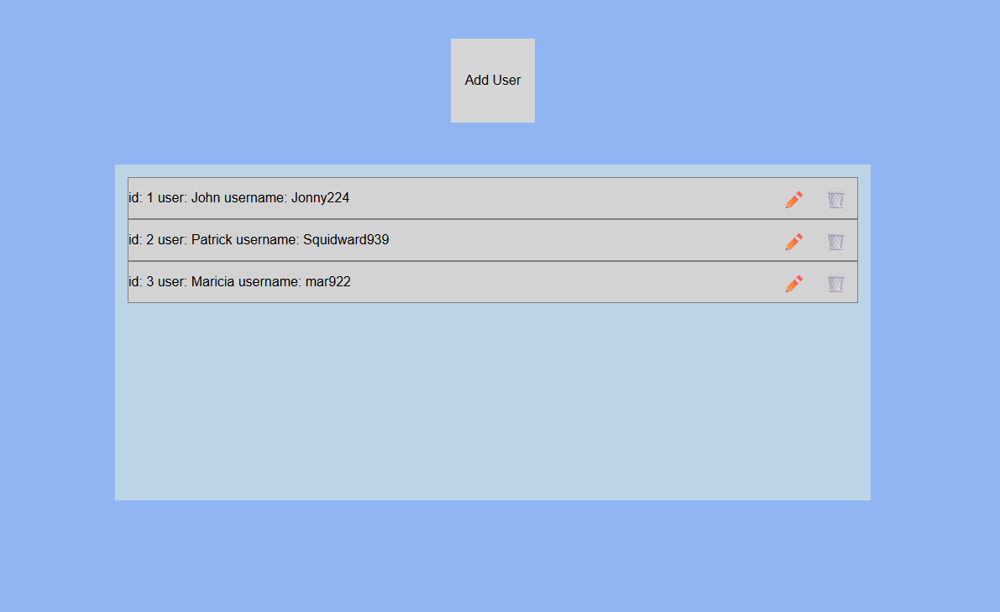

 🚀 Sample React + Express Project

This is a simple full-stack project combining an **Express** backend and a **React** frontend in a single repository.



---
## 🛠️ How to Setup and Run

To run this application locally, you need to open **two separate terminals**.

### 1. Start the Express Server
In your first terminal, navigate to the Express folder and start the server:

```bash
cd Express
npm install
npm start
```
*The server will run on `http://localhost:3000`.*

### 2. Start the React App
In your second terminal, navigate to the React folder and start the development server:

```bash
cd React
npm install
npm start
```
*The React app will open in your browser (usually at `http://localhost:3001` or `http://localhost:5173`).*

---

## ⚠️ Requirements
* Make sure both terminals remain open while using the app.
* Ensure **CORS** is enabled in your Express server to allow the React app to fetch data.
